# PungSwap

<!-- PROJECT LOGO -->
<br />
<p align="center">
        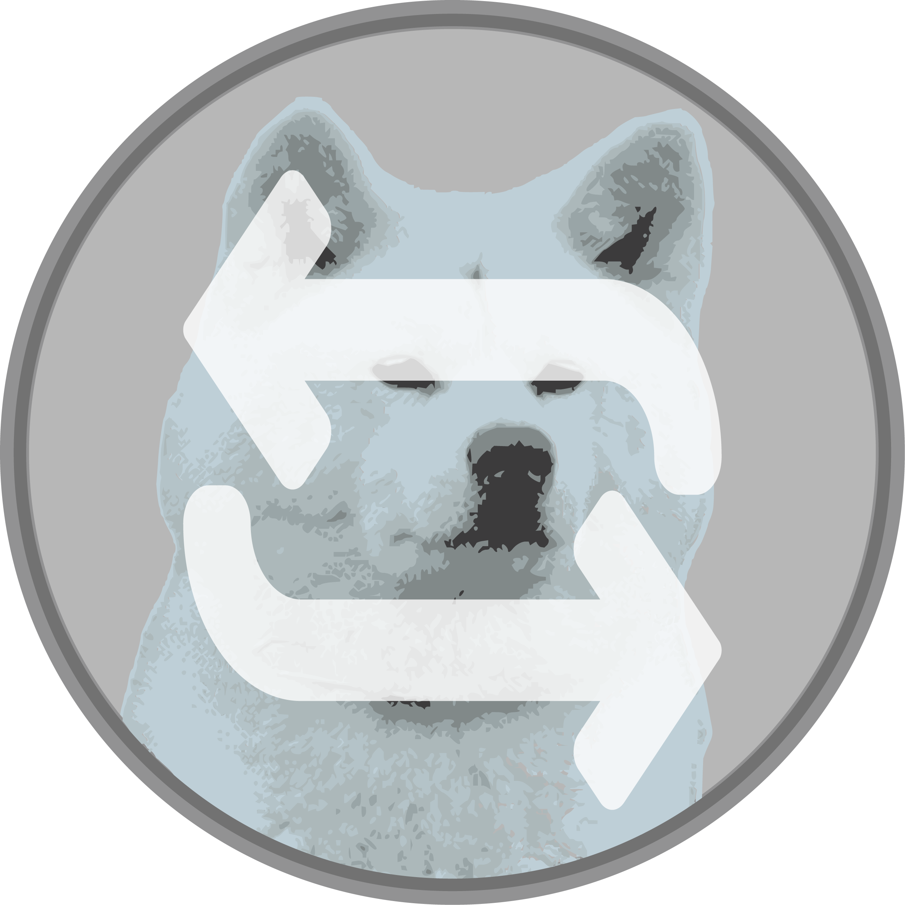
</p>

## Description

PungSwap is an ethereum exchange platform that is used to swap a ERC20 token called Pungcoin. Pungcoin is a cryptocurrency named after pungsan dog breed. Pungswap is used to swap ether for pungcoin or vice versa.

<p align="center">
        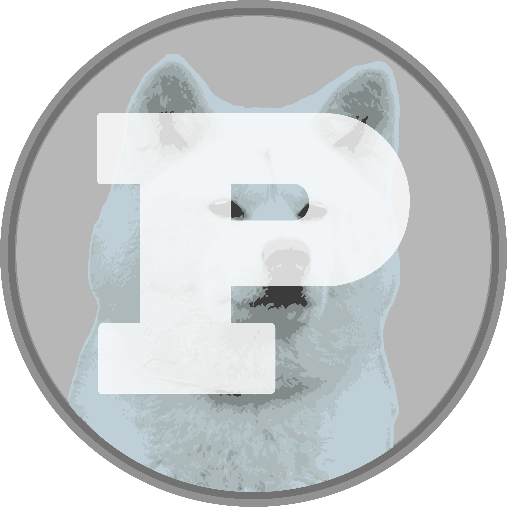
</p>

## Built With

- [React](https://reactjs.org/)
- [Tailwindcss](https://tailwindcss.com/)
- [Solidity](https://docs.soliditylang.org/en/v0.8.4)
- [Truffle](https://www.trufflesuite.com/truffle)
- [Web3.js](https://web3js.readthedocs.io/en/v1.3.4/)

## Screenshots

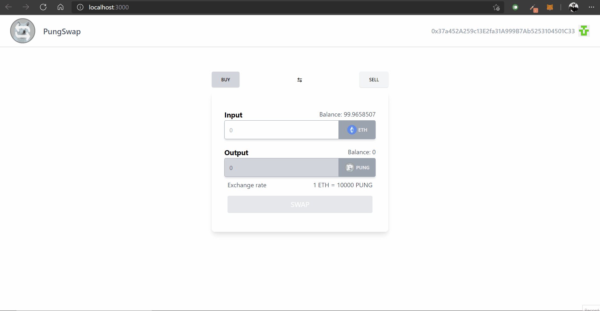
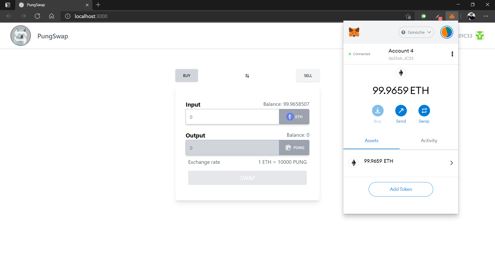
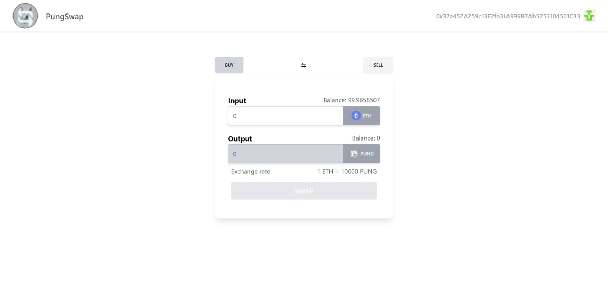
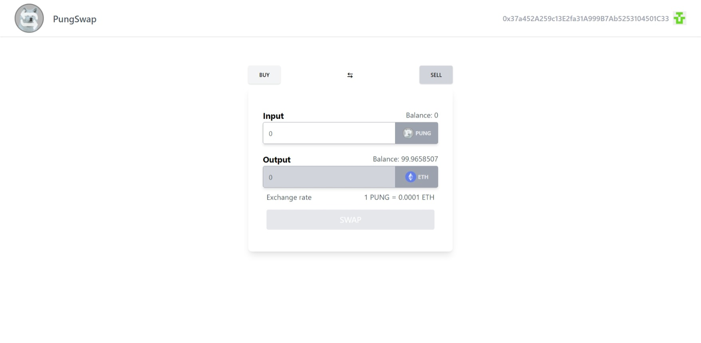
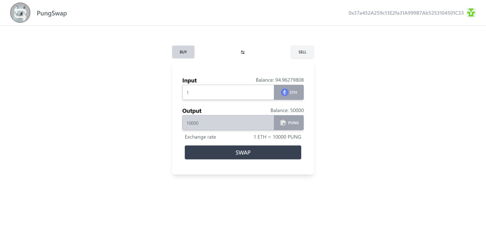
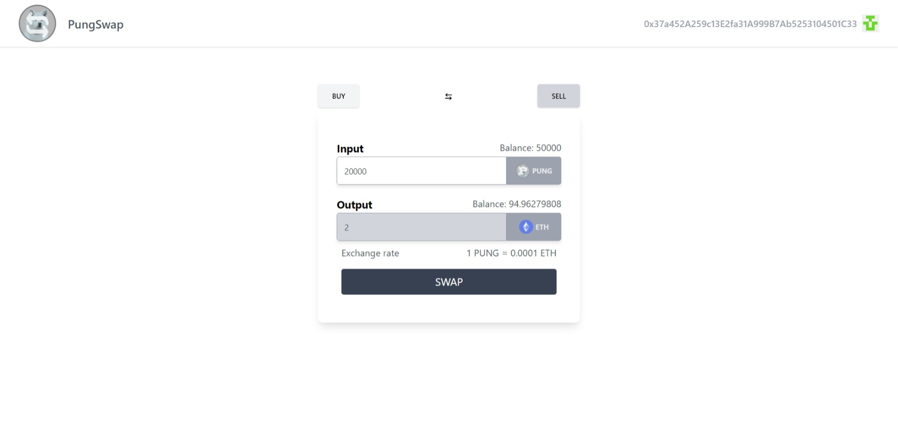
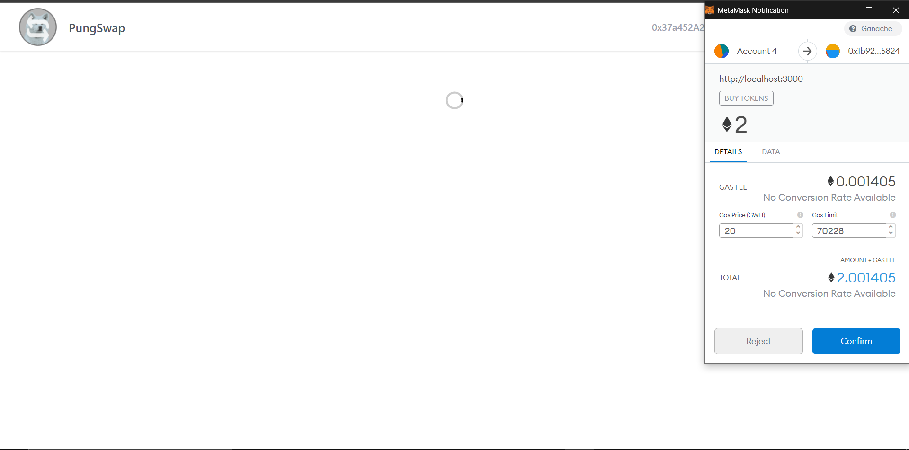
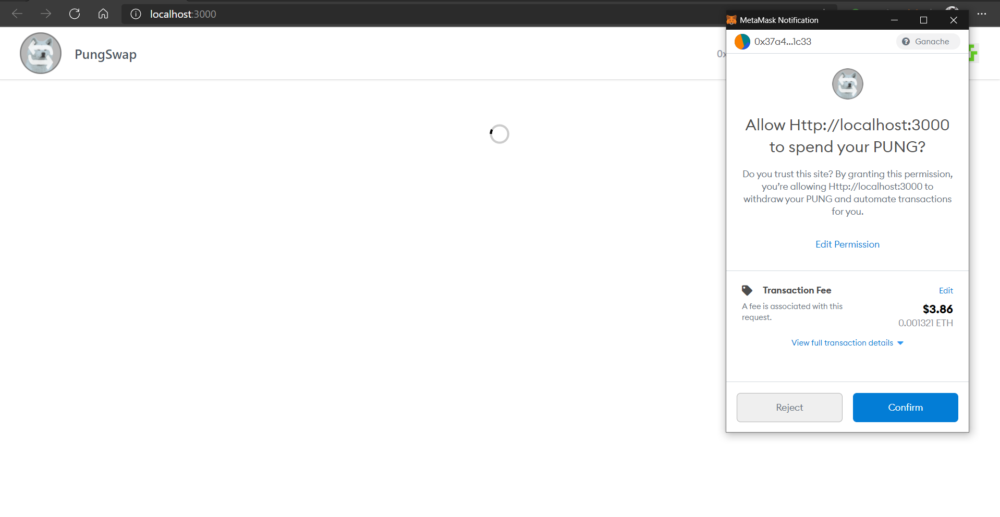
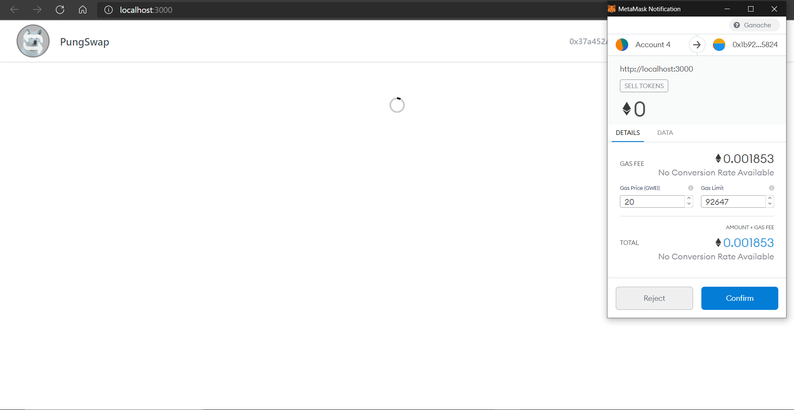

## Prerequisites

- [Node](https://nodejs.org/en/) (and npm)
- [Ganache](https://www.trufflesuite.com/ganache)
- [MetaMask](https://metamask.io/)

## Development server

navigate into the root folder and run:

- install dependencies
  ```sh
  npm i
  ```
- install truffle
  ```sh
  npm i truffle
  ```
- open ganache

- run truffle migrations
  ```sh
  truffle migrate --reset
  ```
- run react development server
  ```sh
  npm start
  ```
